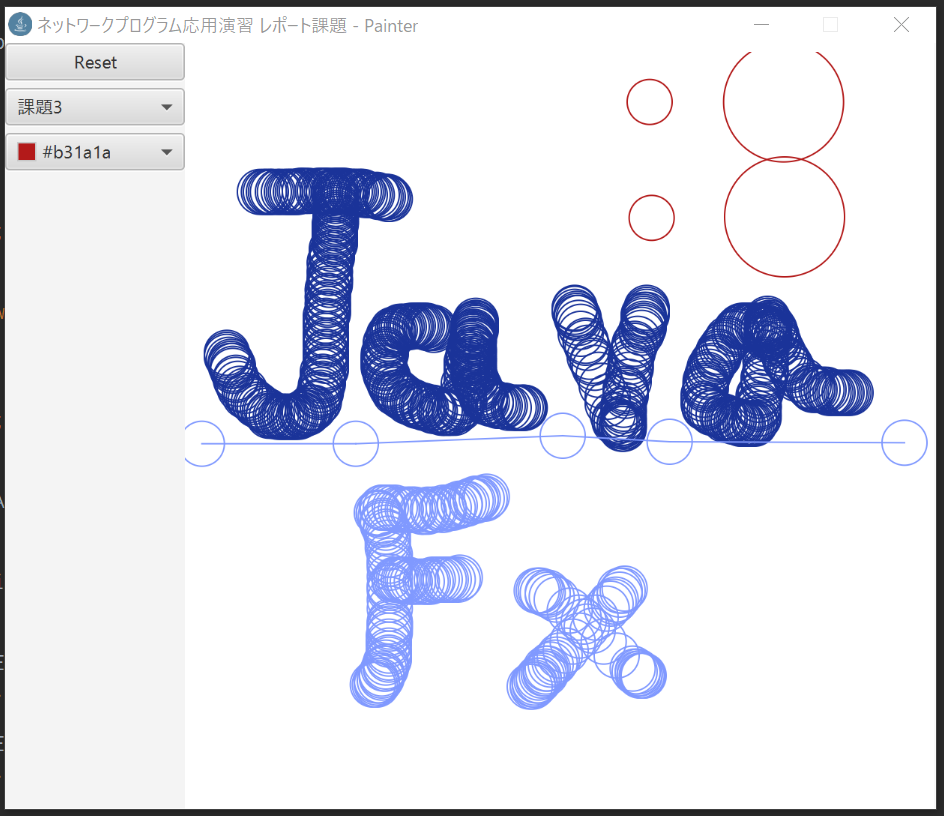

# 4s-program-painter
JavaFXを利用したシンプルなペインター。
課題提出用。



## Build
* JavaFXがビルドできる環境である必要があります。
* ソース内に日本語が含まれているため、`-encoding UTF-8`オプションを指定する必要があります。

```
> cd src
> javac -encoding UTF-8 ./Painter/Painter.java
> java Painter.Painter
```
